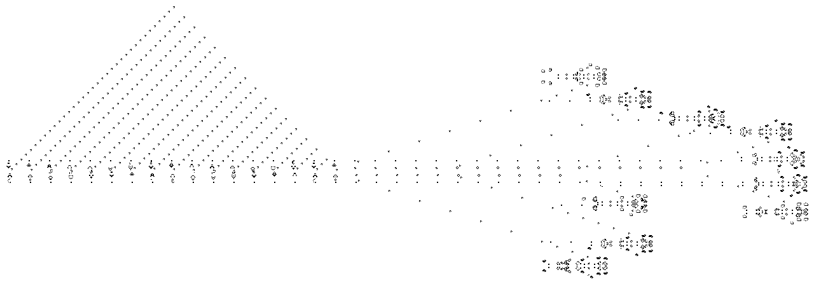

# smeagol

[](https://travis-ci.com/billyrieger/smeagol)
[](https://codecov.io/gh/billyrieger/smeagol/branch/master)
[](https://github.com/Aaronepower/tokei)
[](https://crates.io/crates/smeagol)
[](https://docs.rs/smeagol/)
[](https://github.com/billyrieger/smeagol/blob/master/LICENSE)
[](https://deps.rs/repo/github/billyrieger/smeagol)
[](https://www.rust-lang.org/)

## Introduction

`smeagol` is a Rust library built to efficiently simulate large patterns in the cellular automaton
[Conway's Game of Life](http://www.conwaylife.com/wiki/Conway%27s_Game_of_Life). It uses the
HashLife algorithm developed by Bill Gosper to achieve tremendous speedups for repetitive patterns.
A good explanation of HashLife can be found
[here](http://www.drdobbs.com/jvm/an-algorithm-for-compressing-space-and-t/184406478).

## Usage

Add `smeagol` to your `Cargo.toml`:

```toml
[dependencies]
smeagol = "0.1"
```

Then, start simulating Conway's Game of Life!

```rust
fn main() -> Result<(), failure::Error> {
    // load a pattern
    let mut life = smeagol::Life::from_rle_file("breeder1.rle")?;

    // step 1024 generations into the future
    life.set_step_log_2(10);
    life.step();

    // save the result
    let bbox = life.bounding_box().unwrap().pad(10);
    life.save_png("breeder1.png", bbox, 0)?;

    Ok(())
}
```

This produces the following image:



See [the documentation](https://docs.rs/smeagol/) for more.

## Limitations

Currently there is no garbage collection. Large patterns will eventually crash the program if left
running. This will be fixed in the future.

Only the Life rule B3/S23 is supported.

## License

`smeagol` is licensed under the Mozilla Public License version 2.0. See the [license
file](https://github.com/billyrieger/smeagol/blob/master/LICENSE) and the [MPL 2.0
FAQ](https://www.mozilla.org/en-US/MPL/2.0/FAQ/) for more details.
